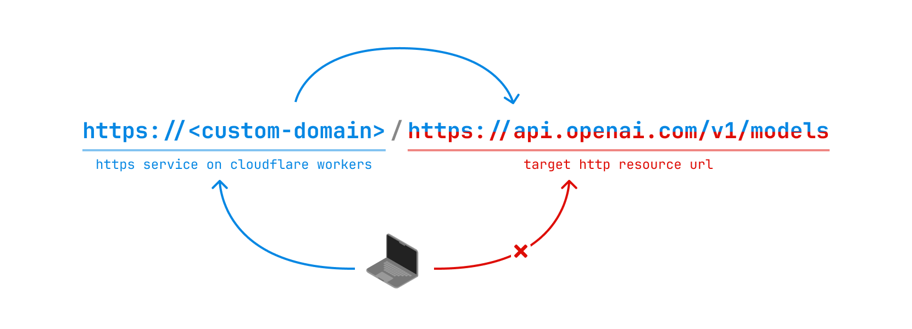

通过 [Cloudflare Workers](https://developers.cloudflare.com/workers/) 代理 HTTP 请求。



Cloudflare Workers 目前仅支持 outbound TCP sockets，如果将来支持了 inbound TCP connection，则可以做成真正的 HTTP 代理，用在 `curl --proxy ""` 等地方。

## 部署

点击下面的按钮直接部署：

[](https://deploy.workers.cloudflare.com/?url=https://github.com/sherluok/cloudflare-workers-proxy.git)

## 二次开发

如果需要用户名密码或其它功能，则先二次开发再通过命令行部署：

```sh
git clone https://github.com/sherluok/cloudflare-workers-proxy.git
cd cloudflare-workers-proxy
npm install
npm run dev
npm run deploy
```

## 参考资料

- https://developers.cloudflare.com/workers/
- https://developers.cloudflare.com/workers/wrangler/
- https://developers.cloudflare.com/workers/languages/typescript/
- https://developers.cloudflare.com/workers/runtime-apis/tcp-sockets/#considerations
- https://blog.cloudflare.com/workers-tcp-socket-api-connect-databases/
- https://blog.cloudflare.com/introducing-socket-workers/
